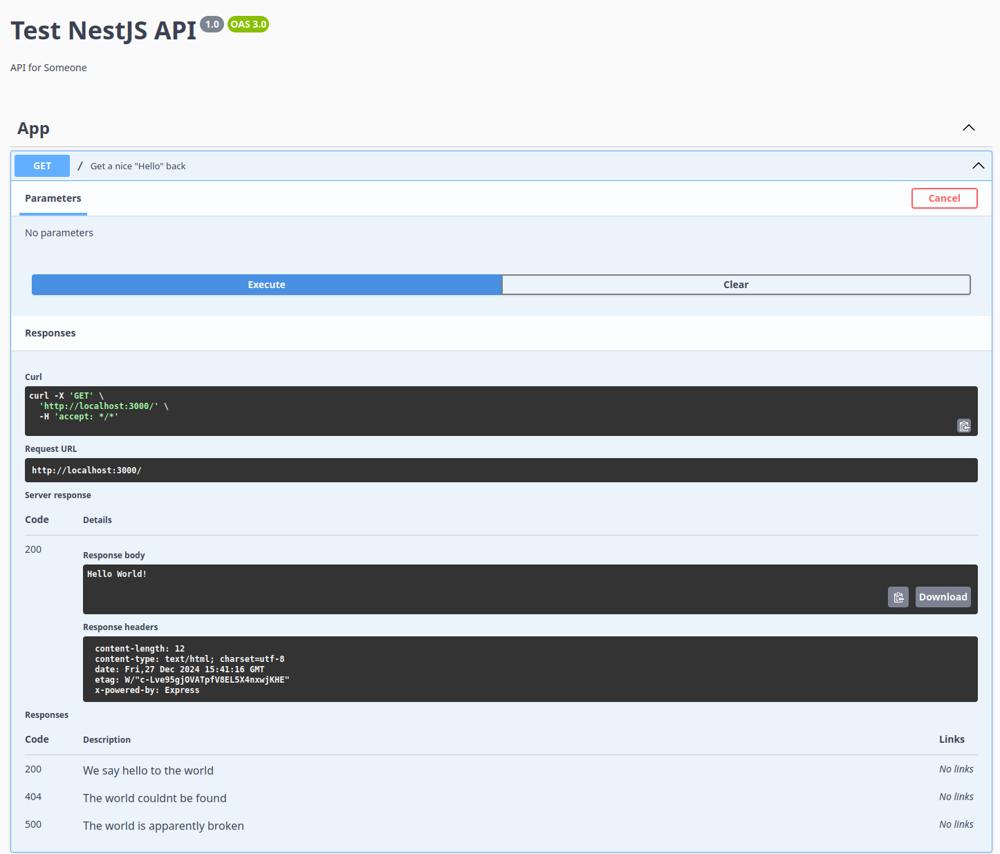

# NestJS with MongoDB, Nginx, Docker & Cloudflare

## NestJS with MongoDB

### NestJS Setup

We start pretty simple. Just follow the [official setup-guide of NestJS](https://docs.nestjs.com/first-steps 'NestJS First Steps'). I will use npm as package manager for simplicity, but you can of course choose whichever you want. We will also use the default Express-platform of NestJS instead of Fastify or others. I'm all for efficiency, but for now simplicity serves us well.

After you created the project it ready for testing and playing around. You can reach it under localhost:3000.

There are several things every server needs to deal with. While not the most important, we will start with documentation. Yea, I know nobody likes it, which is why we will be just outsourcing that to Swagger.

If you don't know it, Swagger is a collection of tools to design and create REST-like APIs. And it gives us the tooles to not only do that very simple for whatever we will create, but also generates a static website we can serve for others. That way everyone will be able to easily understand and even test our mighty server.

#### Swagger

It's pretty simple. We just install the NestJS swagger-packages:

```bash
npm i @nestjs/swagger
```

With that, we only need to decorate our main.ts and any endpoints we have. Our **main.ts** will look like this:

```typescript
import { NestFactory } from '@nestjs/core';
import { AppModule } from './app.module';
import { DocumentBuilder, SwaggerModule } from '@nestjs/swagger';

async function bootstrap() {
	const app = await NestFactory.create(AppModule);

	const config = new DocumentBuilder()
		.setTitle('Test NestJS API')
		.setDescription('API for Someone')
		.setVersion('1.0')
		.build();
	const documentFactory = () => SwaggerModule.createDocument(app, config);
	SwaggerModule.setup('api', app, documentFactory);

	await app.listen(process.env.PORT ?? 3000);
}
bootstrap();
```

There are more things we could add, but those are the important ones for now. Later on we will add a way to use BearerAuthentication.

(On a random sidenote and because this is the first time we are editting a file: I added a .editorconfig file. That way I have controle over the indents. Just two spaces is too small)

```
root = true

[*]
charset = utf-8
end_of_line = crlf
insert_final_newline = true
max_line_length = 120
indent_style = space
indent_size = 4
tab_width = 4

[*.sh]
end_of_line = lf
```

Now, for our endpoints, we can decorate our getHello() like this (**app.controller.ts**):

```typescript
import { Controller, Get } from '@nestjs/common';
import { AppService } from './app.service';
import { ApiOperation, ApiResponse } from '@nestjs/swagger';

@Controller()
export class AppController {
	constructor(private readonly appService: AppService) {}

	@Get()
	@ApiOperation({ summary: 'Get a nice "Hello" back' })
	@ApiResponse({ status: 200, description: 'We say hello to the world' })
	@ApiResponse({ status: 404, description: 'The world couldnt be found' })
	@ApiResponse({ status: 500, description: 'The world is apparently broken' })
	getHello(): string {
		return this.appService.getHello();
	}
}
```

And with this we are ready to look at our swagger api. Just run the server and go under localhost:3000/api:



You can read more about the swagger implementation [here](https://docs.nestjs.com/openapi/introduction 'NestJS Swagger Docu').

With that out of the way, let's get to the meat of a server:

### Endpoints

The most important functions are authentication and authorization. We don't want to just anyone having access to any data. We also want to be able to expose specific routes only to specific users/groups. I will go over Authentication, Authorization and Users in their chapters. But to be honest, they only work as one package. While were working on the different areas, the server will probably not start correctly.

So, without further ado, let's implement all three.

#### Users

For this we utilise the nestjs cli:

```bash
nest generate module user
nest generate controller user
nest generate service user
```

This gives use a new user-folder with our files and already adds the controller, service and module to their respective files.

The first thing we will create are our functions to create & update users and to return their data. For that we go into our **user.service.ts** file:

```typescript
import { forwardRef, Inject, Injectable, Logger } from '@nestjs/common';
import { AuthService } from 'src/auth/auth.service';
import { User } from './model/user.model';

@Injectable()
export class UserService {
	private readonly logger = new Logger(UserService.name);
	constructor(@Inject(forwardRef(() => AuthService)) private authService: AuthService) {}

	public async findOneByEmail(query: any): Promise<User> {
		this.logger.log(`Finding user ${JSON.stringify(query)}`);
		return mockUserData.find((user) => user.email === query.email);
	}

	public async create(user: any): Promise<User> {
		this.logger.log(`Creating user ${JSON.stringify(user)}`);
		user.password = await this.authService.getHashedPassword(user.password);
		mockUserData.push(user);
		return user;
	}

	public async findOneAndUpdate(query: any, playload: User): Promise<User> {
		this.logger.log(`Updating user ${JSON.stringify(query)}`);
		let updatedUser;
		mockUserData.map((user) => {
			if (user.email === playload.email) {
				user.firstName = playload.firstName;
				user.lastName = playload.lastName;
				user.email = playload.email;
				user.password = playload.password;
				updatedUser = user;
			}
		});
		return updatedUser;
	}

	public async findOneAndDelete(query: any): Promise<User> {
		this.logger.log(`Deleting user ${JSON.stringify(query)}`);
		mockUserData.map((user, index) => {
			if (user.email === query.email) {
				mockUserData.splice(index, 1);
				return user;
			}
		});
		return null;
	}
}
```

This now has all the funcionality we need. It of course also needs some mockData:

```typescript
const mockUserData = [
	{
		firstName: 'Mock1',
		lastName: 'User',
		email: 'mock1@test.com',
		password: 'mockpassword1',
	},
	{
		firstName: 'Mock2',
		lastName: 'User',
		email: 'mock2@test.com',
		password: 'mockpassword2',
	},
	{
		firstName: 'Mock3',
		lastName: 'User',
		email: 'mock3@test.com',
		password: 'mockpassword3',
	},
];
```

As you can see, we already need another service to correctly hash a user-password (we don't want anything saved in plain-text, do we?)
But for now, we will finish up our User section. As you can see from the mockData, we expect a specific kind of object as User. So this is the next thing. We need one User interface that will also function as our Schema, and one login DTO (Data-Transfer-Object) to measure against the authentication we will be implementing later.

```bash
mkdir ./src/user/model
touch ./src/user/model/user.model.ts
touch ./src/user/model/user-login.dto.ts
```

And this is how the two files look like:

```typescript
import { ApiProperty } from '@nestjs/swagger';

export class UserLoginDto {
	@ApiProperty({ example: 'user@example.com', description: 'The email of the user' })
	email: string;

	@ApiProperty({ example: 'password123', description: 'The password of the user' })
	password: string;
}
```

and

```typescript
import { ApiProperty } from '@nestjs/swagger';

export class User {
	@ApiProperty({ description: 'Users first name', example: 'Max' })
	firstName: string;

	@ApiProperty({ description: 'Users last name', example: 'Mustermann' })
	lastName: string;

	@ApiProperty({ description: 'Users email', example: 'default@example.com' })
	email: string;

	@ApiProperty({ description: 'Users password', example: 'MyVerySecurePassword' })
	password: string;
}
```

As you can see, we also already decorated the variables with some swagger. This will also just automatically be now available in our /api endpoint.

Btw, you get a whole setup of something similar with

```bash
nest generate resource test
? What transport layer do you use? REST API
? Would you like to generate CRUD entry points? Yes
CREATE src/test/test.controller.spec.ts (556 bytes)
CREATE src/test/test.controller.ts (883 bytes)
CREATE src/test/test.module.ts (241 bytes)
CREATE src/test/test.service.spec.ts (446 bytes)
CREATE src/test/test.service.ts (607 bytes)
CREATE src/test/dto/create-test.dto.ts (30 bytes)
CREATE src/test/dto/update-test.dto.ts (164 bytes)
CREATE src/test/entities/test.entity.ts (21 bytes)
UPDATE src/app.module.ts (994 bytes)
```

but I prefer my own naming :)

Next, we need to build the endpoints for user-actions, which will live in the **user.controller.ts**

```typescript
import { ConflictException, Controller, Get, Logger, Post, Request, Response, UseGuards } from '@nestjs/common';
import { UserService } from './user.service';
import { ApiBearerAuth, ApiBody, ApiOperation, ApiResponse, ApiTags } from '@nestjs/swagger';
import { User } from 'src/user/model/user.model';
import { AdminAuthGuard } from 'src/auth/guards/admin-auth.guard';

@ApiTags('User')
@Controller('user')
export class UserController {
	logger: Logger = new Logger(UserController.name);
	constructor(private readonly usersService: UserService) {}

	@Post('create')
	@UseGuards(AdminAuthGuard)
	@ApiOperation({ summary: 'Create a new user' })
	@ApiBody({ description: 'User data', type: User })
	@ApiResponse({ status: 201, description: 'The user has been successfully created.' })
	@ApiResponse({ status: 401, description: 'User unauthorized' })
	@ApiResponse({ status: 409, description: 'User already exists.' })
	public async create(@Request() req: any, @Response() res): Promise<any> {
		this.logger.log(`Creating user ${JSON.stringify(req.body)}`);
		const newUser = req.body;
		try {
			const query = { email: newUser.email };
			const isUser = await this.usersService.findOneByEmail(query);
			if (!!isUser) {
				throw new ConflictException('User already exists');
			}
			const user = await this.usersService.create(newUser);
			const response = user.toObject();
			delete response.password;
			return res.status(201).json(response);
		} catch (error) {
			this.logger.error(`Error creating user ${JSON.stringify(error)}`);
			return res.status(409).json(error);
		}
	}

	@Get('profile')
	@ApiOperation({ summary: 'Get user profile' })
	@ApiBearerAuth()
	@ApiResponse({ status: 200, description: 'The user profile has been successfully retrieved.' })
	@ApiResponse({ status: 401, description: 'Unauthorized.' })
	@ApiResponse({ status: 500, description: 'Internal server error.' })
	public async getProfile(@Request() req: any, @Response() res): Promise<any> {
		this.logger.log(`Getting user profile...}`);
		try {
			const authHeader = req.headers.authorization;
			const token = authHeader ? authHeader.split(' ')[1] : null;
			this.logger.log(`JWT Token: ${token}`);
			this.logger.log(`Getting user profile ${JSON.stringify(req.user)}`);
			const user = await this.usersService.findOneByEmail({ email: req.user.email });
			return res.status(200).json(user);
		} catch (error) {
			this.logger.error(`Error getting user profile ${error}`);
			res.status(500).json(error);
		}
	}

	@Put('update')
	@ApiOperation({ summary: 'Update user profile' })
	@ApiBearerAuth()
	@ApiBody({ description: 'User data', type: User })
	@ApiResponse({ status: 200, description: 'The user profile has been successfully updated.' })
	@ApiResponse({ status: 401, description: 'Unauthorized.' })
	@ApiResponse({ status: 500, description: 'Internal server error.' })
	public async update(@Request() req: any, @Response() res): Promise<any> {
		this.logger.log(`Updating user profile...}`);
		try {
			const user = req.body;
			const query = { email: user.email };
			const updatedUser = await this.usersService.findOneAndUpdate(query, user);
			return res.status(200).json(updatedUser);
		} catch (error) {
			this.logger.error(`Error updating user profile ${error}`);
			res.status(500).json(error);
		}
	}

	@Delete('delete')
	@ApiOperation({ summary: 'Delete user profile' })
	@ApiBearerAuth()
	@ApiResponse({ status: 200, description: 'The user profile has been successfully deleted.' })
	@ApiResponse({ status: 401, description: 'Unauthorized.' })
	@ApiResponse({ status: 500, description: 'Internal server error.' })
	public async delete(@Request() req: any, @Response() res): Promise<any> {
		this.logger.log(`Deleting user profile...}`);
		try {
			const query = { email: req.user.email };
			await this.usersService.findOneAndDelete(query);
			return res.status(200).json({ message: 'User deleted successfully' });
		} catch (error) {
			this.logger.error(`Error deleting user profile ${error}`);
			res.status(500).json(error);
		}
	}
}
```

Now, there is a lot going on here. Most of the decorators are just for swagger documentation. But three are important:

The @Controller not only tells NestJS, that this is a controller, but also under which route it should be available (/user in this case).

The @Post/@Get/@Put/@Delete represents the next part of the URI and of course tell us what kind of API-Operation they expect.

And lastly @UseGuards tells NestJS, that this route is protected by whatever guard we specify. In this case, we want to restrict the creation of user-objects to only users with admin priviliges. As we could see, our User-model has no "roles" variable or something similar. You'll have to implement that on your own, according to your needs and specifics. For the moment we'll just ask for one specific user.

Another thing to note is of course, that we log a lot of the functions, including tokens and user-data. You might don't want to do that in production-settings.

And with that, the only thing left to do is to include everything in our **user.module.ts**

```typescript
import { forwardRef, Module } from '@nestjs/common';
import { UserController } from './user.controller';
import { AuthModule } from 'src/auth/auth.module';
import { UserService } from './user.service';
import { JwtAuthGuard } from 'src/auth/guards/jwt-auth.guard';

@Module({
	imports: [forwardRef(() => AuthModule)],
	controllers: [UserController],
	providers: [UserService, { provide: 'APP_GUARD', useClass: JwtAuthGuard }],
	exports: [UserService],
})
export class UserModule {}
```

And that's it for the User part. But we already know where to work next. We have at the very least an AuthService and some kind of guard, that we need to create. Next is the

#### Authentication/Authorization

The setup is pretty similar to user. We first need a module, then a controller and a service:

```bash
nest generate module auth
nest generate service auth
nest generate controller auth
```

This will now be the most complicated part of this tutorial. We need four things. Guards to check our endpoints. A way to bypass guards if we want to. A way to authenticate any given user. A way to authorize a user.

Let's start with a service to authenticate our users: (**auth.service.ts**)

```typescript
import { Injectable, forwardRef, Inject, UnauthorizedException, NotFoundException } from '@nestjs/common';
import * as bcrypt from 'bcrypt';

import { JwtService } from '@nestjs/jwt';
import { UserService } from 'src/user/user.service';
import { UserLoginDto } from 'src/user/model/user-login.dto';

@Injectable()
export class AuthService {
	constructor(
		@Inject(forwardRef(() => UserService))
		private userService: UserService,
		private jwtService: JwtService,
	) {}

	public async validateUser(email: string, pass: string): Promise<any> {
		const query = { email: email };
		const user = await this.userService.findOneByEmail(query);
		if (!user) {
			throw new NotFoundException('Email Does not exist');
		}
		const isMatched = await this.comparePasswords(pass, user.password);
		if (!isMatched) {
			throw new UnauthorizedException('Invalid Password');
		}
		return user;
	}

	public async generateJwtToken(user: UserLoginDto): Promise<any> {
		const payload = {
			email: user.email,
		};
		return {
			access_token: this.jwtService.sign(payload),
		};
	}

	public async getHashedPassword(password: string): Promise<any> {
		return new Promise((resolve, reject) => {
			bcrypt.hash(password, 10, (err, hash) => {
				if (err) {
					reject(err);
				}
				resolve(hash);
			});
		});
	}

	private async comparePasswords(password: string, hashedPassword: string): Promise<any> {
		return bcrypt
			.compare(password, hashedPassword)
			.then((isMatch: boolean) => {
				return !!isMatch;
			})
			.catch((err) => err);
	}
}
```

There are a few important things to note about this service. Firstly, it needs a UserService, which means we have to not only include it somehow in our module, but also to export it from our **user.module.ts**. Next, we have two utility functions to generate and compare passwords.
We are using bcrypt as a simple library to hash any password we are getting send. Nobody wants plain-text passwords saved anywhere. The important thing here is, that we are encrypting the passwords with a special key. That key is also used to decrypt passwords again, if we need to compare it.
Lastly there is a function that generates our JWT for any user with access rights. That JWT is then the main authorization for other endpoints (See @BearerAuth() in **user.controller.ts**).

The nestjs/jwtService comes from nestjs/jwt:

```bash
npm i nestjs/jwt
```

Next, we need our **auth.controller.ts**

```typescript
import { Controller, Post, Logger, UseGuards, Body } from '@nestjs/common';
import { AuthService } from './auth.service';
import { SkipAuth } from './guards/skipAuth.decorator';
import { LocalAuthGuard } from './guards/local-auth.guard';
import { ApiBody, ApiOperation, ApiResponse } from '@nestjs/swagger';
import { UserLoginDto } from 'src/user/model/user-login.dto';

@Controller('auth')
export class AuthController {
	private readonly logger: Logger = new Logger(AuthController.name);
	constructor(private readonly authService: AuthService) {}

	@Post('login')
	@SkipAuth()
	@UseGuards(LocalAuthGuard)
	@ApiOperation({ summary: 'Login with credentials and get a JWT' })
	@ApiBody({ description: 'User data', type: UserLoginDto })
	@ApiResponse({ status: 201, description: 'The user is logged in and JWT was created.' })
	@ApiResponse({ status: 401, description: 'Invalid Password' })
	@ApiResponse({ status: 404, description: "User email doesn't exist." })
	@ApiResponse({ status: 500, description: 'Internal server error.' })
	public async login(@Body() userLoginDto: UserLoginDto): Promise<any> {
		try {
			return await this.authService.generateJwtToken(userLoginDto);
		} catch (error) {
			throw error;
		}
	}
}
```

As we can see, it's a pretty simple endpoint. The only thing of note is the [guard](https://docs.nestjs.com/guards 'NestJS Guards') we are using (**local-auth.guard.ts**) and the skip decorator (**skipAuth.decorator.ts**). Other than those, we just call the service to get a JWT, IF the user passes the guard. Speaking of, we are now building our auth guards. First thing is to install [passport](https://docs.nestjs.com/recipes/passport 'NestJS Passport Integration') for nestjs:

```bash
npm i @nestjs/passport passport passport-local
npm i --save-dev @types/passport-local
```

And with that we now create our LocalAuthGuard.

```typescript
import { Injectable, HttpException } from '@nestjs/common';
import { AuthGuard } from '@nestjs/passport';

@Injectable()
export class LocalAuthGuard extends AuthGuard('local') {
	handleRequest(err: any, user: any, info: any, context: any, status: any) {
		if (err || !user) {
			throw new HttpException(err.message, err.status);
		}
		return user;
	}
}
```

What we are doing, is to extend the AuthGuard passport provides for us. This enables us to handle any request and use any AuthStrategy we wish to use. You can see, that we are using a Strategy with the name 'local'. This is the default-name for any Strategy. Later on we'll also build a 'admin' and a 'jwt' Strategy. For now, we only need to know, that this 'handleRequest' also uses the validation method of AuthGuard according to the loaded Strategy:

```typescript
import { Strategy } from 'passport-local';
import { PassportStrategy } from '@nestjs/passport';
import { Injectable, Logger } from '@nestjs/common';
import { AuthService } from '../auth.service';

@Injectable()
export class LocalStrategy extends PassportStrategy(Strategy, 'local') {
	private readonly logger: Logger = new Logger(LocalStrategy.name);
	constructor(private authService: AuthService) {
		super({ usernameField: 'email' });
	}

	async validate(email: string, password: string): Promise<any> {
		const user = await this.authService.validateUser(email, password);
		this.logger.log('Logged In User, checking at local auth:', user);
		return user;
	}
}
```

As you can see, we're leveraging the auth.service to check a users email. While the name 'local' might be default, I still like to include it in the creation of this Strategy.

The next thing we saw was a decorator named SkipAuth. I'll be skipping ahead a little for now. In short order, we'll create a JWTGuard, and register it globally for every route. But of course, you can't use a JWT for a route, that generates said JWT. Therefore we have to disable any guard we deem neccessary for this route. That's what **skipAuth.decorator.ts** is for:

```typescript
import { SetMetadata } from '@nestjs/common';

export const IS_PUBLIC_KEY = 'isPublic';
export const SkipAuth = () => SetMetadata(IS_PUBLIC_KEY, true);
```

It's pretty simple. This decorator sets Metadata. In any given Strategy, we now can check for this metadata. For example, here is the code-snippet from our future JWTGuard:

```typescript
const isPublic = this.reflector.getAllAndOverride<boolean>(IS_PUBLIC_KEY, [context.getHandler(), context.getClass()]);
if (isPublic) {
	return true;
}
```

We are extracting the IS_PUBLIC_KEY variable from our context. If it's true (which happens, when the endpoint is decorated with @SkipAuth) we just return true, meaning that the user is authenticated to use this endpoint.

With that, we now would have a working authentication. We could use it to check our user endpoints and guard them with the LocalStrategy. But as mentioned, we want to check for BearerAuth (JWT), and we also want special permissions for admins (or any other role in the future). So, let's build it:

Just as with the local guard, we need need a **jwtStrategy.ts** and a **jwt-auth.guard.ts**. But before we build our strategy, we of course also have to install the passport package

```bash
npm i passport-jwt
npm i --save-dev @types/passport-jwt
```

Now, for our strategy we again extend the PassportStrategy, this time with the jwt modifier. And to validate our user, we want to extract the email from the token:

```typescript
import { ExtractJwt, Strategy } from 'passport-jwt';
import { forwardRef, Inject, Injectable, Logger } from '@nestjs/common';
import { PassportStrategy } from '@nestjs/passport';
import { UserService } from 'src/user/user.service';
import { jwtConstants } from './constants';

@Injectable()
export class JwtStrategy extends PassportStrategy(Strategy, 'jwt') {
	private readonly logger: Logger = new Logger(JwtStrategy.name);

	constructor(
		@Inject(forwardRef(() => UserService))
		private readonly usersService: UserService,
	) {
		super({
			jwtFromRequest: ExtractJwt.fromAuthHeaderAsBearerToken(),
			ignoreExpiration: false,
			secretOrKey: jwtConstants.secret,
			usernameField: 'email',
		});
	}

	async validate(payload: any) {
		this.logger.log('Validate passport:', payload);
		return await this.usersService.findOneByEmail({ email: payload.email });
	}
}
```

You could test for more, but the JWT already functions as a password. Only authenticated users get a JWT, and only JWTs incorporating a valid email are validated. Good enough for now.

With that we now create our guard:

```typescript
import { ExecutionContext, Injectable, UnauthorizedException } from '@nestjs/common';
import { Reflector } from '@nestjs/core';
import { JwtService } from '@nestjs/jwt';
import { AuthGuard } from '@nestjs/passport';
import { extractTokenFromHeader } from 'src/utils/request.util';
import { IS_PUBLIC_KEY } from './skipAuth.decorator';
import { jwtConstants } from './constants';

@Injectable()
export class JwtAuthGuard extends AuthGuard('jwt') {
	constructor(
		private jwtService: JwtService,
		private reflector: Reflector,
	) {
		super();
	}

	async canActivate(context: ExecutionContext): Promise<boolean> {
		const isPublic = this.reflector.getAllAndOverride<boolean>(IS_PUBLIC_KEY, [
			context.getHandler(),
			context.getClass(),
		]);
		if (isPublic) {
			return true;
		}

		const request = context.switchToHttp().getRequest();
		const token = extractTokenFromHeader(request);
		if (!token) {
			throw new UnauthorizedException();
		}
		try {
			const payload = await this.jwtService.verifyAsync(token, {
				secret: jwtConstants.secret,
			});
			request['user'] = payload;
		} catch (error) {
			throw new UnauthorizedException(error.message);
		}
		return true;
	}
}
```

Just as before, we check for an override from the metadata. If not, we check the JWT and extract the user object from it, using a secret constant.
Now, this is important: You secret-constant should never be public and as sophisticated as you can make it. It's used to sign and, in this case, decode you JWT. For tutorial purposes, I included it as a hardcoded string in **constants.ts**

```typescript
export const jwtConstants = {
	secret: 'JWTSecret#@!',
};
```

In a production-environment, this is a secret, that should be set by a workflow (I'm using Github workflows for example. More regarding those in a later part of this tutorial).

Also, now is a perfect time to create util functions. We need a recouring way to extract the JWT from request header: **utils/request.util.ts**

```typescript
import { Request } from 'express';

export const extractTokenFromHeader = (request: Request): string | undefined => {
	const [type, token] = request.headers.authorization?.split(' ') || [];
	return type === 'Bearer' ? token : undefined;
};
```

And there we go. We implemented a JWT guard to be used for anything we want. Only one guard left: A guard just for us, the Admin. Because we are the most important snowflakes :D

```typescript
import { ExtractJwt, Strategy } from 'passport-jwt';
import { forwardRef, Inject, Injectable, Logger, UnauthorizedException } from '@nestjs/common';
import { PassportStrategy } from '@nestjs/passport';
import { UserService } from 'src/user/user.service';

@Injectable()
export class AdminStrategy extends PassportStrategy(Strategy, 'admin') {
	private readonly logger: Logger = new Logger(AdminStrategy.name);

	constructor(
		@Inject(forwardRef(() => UserService))
		private readonly usersService: UserService,
	) {
		super({
			jwtFromRequest: ExtractJwt.fromAuthHeaderAsBearerToken(),
			ignoreExpiration: false,
			secretOrKeyProvider: async (request, rawJwtToken, done) => {
				try {
					const adminUser = await this.usersService.findOneByEmail({ email: 'admin@admin.com' });
					if (!adminUser) {
						this.logger.error('Admin user not found');
						return done(new UnauthorizedException('Admin user not found'), false);
					}
					this.logger.log('Admin user found, using password as secret');
					done(null, adminUser.password);
				} catch (error) {
					this.logger.error('Error fetching admin user', error);
					done(error, false);
				}
			},
			usernameField: 'email',
		});
	}

	async validate(payload: any) {
		this.logger.log('Validate ADMIN:', payload);

		// Check if the email in the payload is the admin email
		if (payload.email !== 'admin@admin.com') {
			this.logger.error('Unauthorized access attempt with email:', payload.email);
			throw new UnauthorizedException('Unauthorized access');
		}

		// Fetch the admin user from the database
		const adminUser = await this.usersService.findOneByEmail({ email: payload.email });
		if (!adminUser) {
			this.logger.error('Admin user not found');
			throw new UnauthorizedException('Admin user not found');
		}

		return adminUser;
	}
}
```

Just as before, we extend a strategy, this time with "admin". We're also (for now) only checking one thing: The email must be the admin-email. The admin-user will be created automatically the first time we spin up our server. We'll get to that in a later part.

Now that we have the strategy, we need the guard to extract and check the payload email against the admin email:

```typescript
import { ExecutionContext, Injectable, UnauthorizedException } from '@nestjs/common';
import { JwtService } from '@nestjs/jwt';
import { UserService } from 'src/user/user.service';
import { extractTokenFromHeader } from 'src/utils/request.utils';
import { AuthGuard } from '@nestjs/passport';
import { jwtConstants } from './constants';

@Injectable()
export class AdminAuthGuard extends AuthGuard('admin') {
	constructor(
		private jwtService: JwtService,
		private userService: UserService,
	) {
		super();
	}

	async canActivate(context: ExecutionContext): Promise<boolean> {
		const request = context.switchToHttp().getRequest();
		const token = extractTokenFromHeader(request);
		if (!token) {
			throw new UnauthorizedException();
		}

		try {
			// Fetch the specific user (e.g., admin user)
			const adminUser = await this.userService.findOneByEmail({ email: 'admin@admin.com' });
			if (!adminUser) {
				throw new UnauthorizedException('Admin user not found');
			}

			// Verify the token using the admin user's password
			const payload = await this.jwtService.verifyAsync(token, {
				secret: jwtConstants.secret,
			});
			console.log('Payload: ', payload);
			if (payload.email !== adminUser.email) {
				throw new UnauthorizedException('Unauthorized access');
			}
			request['user'] = payload;
		} catch (error) {
			throw new UnauthorizedException(error.message);
		}
		return true;
	}
}
```

Only thing left to do is to provide our strategys in our auth.module:

```typescript
import { forwardRef, Module } from '@nestjs/common';
import { AuthService } from './auth.service';
import { UserModule } from 'src/user/user.module';
import { JwtModule } from '@nestjs/jwt';
import { jwtConstants } from './guards/constants';
import { AuthController } from './auth.controller';
import { LocalStrategy } from './guards/localStrategy';
import { JwtStrategy } from './guards/jwtStrategy';
import { AdminStrategy } from './guards/adminStrategy';

@Module({
	imports: [
		JwtModule.register({
			global: true,
			secret: jwtConstants.secret,
			signOptions: { expiresIn: '3000s' },
		}),
		forwardRef(() => UserModule),
	],
	providers: [AuthService],
	exports: [AuthService, LocalStrategy, JwtStrategy, AdminStrategy],
	controllers: [AuthController],
})
export class AuthModule {}
```

Well, not quite. We also need something to put into our Database. And we spend so much time building everything to work with User-objects, it's hightime we tell MongoDB how to work with them. For that we first need the correct packages:

```bash
npm i @nestjs/mongoose mongoose @nestjs/config
```

But before we dive into MongoDB, let's enhance our authentication system with a proper **Role-Based Access Control (RBAC)** system. The basic admin guard we created is a good start, but for a production application, we need a more flexible permission system.

#### Role-Based Access Control (RBAC)

A proper RBAC system consists of three main components:

- **Users**: Application users that can be assigned roles
- **Roles**: Collections of permissions that can be assigned to users
- **Permissions**: Specific actions that can be performed on resources

Let's create this step by step.

##### Permissions Model

First, let's create a permission system with granular control:

```bash
mkdir ./src/permission
mkdir ./src/permission/model
mkdir ./src/permission/dto
touch ./src/permission/model/permission.model.ts
touch ./src/permission/dto/create-permission.dto.ts
touch ./src/permission/dto/update-permission.dto.ts
```

The **permission.model.ts** defines our permission structure:

```typescript
import { Prop, Schema, SchemaFactory } from '@nestjs/mongoose';
import { ApiProperty } from '@nestjs/swagger';
import { Document } from 'mongoose';

export enum PermissionAction {
	CREATE = 'create',
	READ = 'read',
	UPDATE = 'update',
	DELETE = 'delete',
	MANAGE = 'manage', // Full access
}

export enum PermissionResource {
	USER = 'user',
	ROLE = 'role',
	PERMISSION = 'permission',
	ALL = 'all', // All resources
}

@Schema({ timestamps: true })
export class Permission {
	@ApiProperty({ description: 'Permission name', example: 'user:read' })
	@Prop({ required: true, unique: true })
	name: string;

	@ApiProperty({ description: 'Permission description', example: 'Can read user information' })
	@Prop()
	description: string;

	@ApiProperty({ description: 'Action allowed', enum: PermissionAction })
	@Prop({ required: true, enum: PermissionAction })
	action: PermissionAction;

	@ApiProperty({ description: 'Resource the permission applies to', enum: PermissionResource })
	@Prop({ required: true, enum: PermissionResource })
	resource: PermissionResource;

	@ApiProperty({ description: 'Whether the permission is active', example: true })
	@Prop({ default: true })
	isActive: boolean;
}

export type PermissionDocument = Permission & Document;
export const PermissionSchema = SchemaFactory.createForClass(Permission);
```

##### Roles Model

Next, create the roles model:

```bash
mkdir ./src/role
mkdir ./src/role/model
mkdir ./src/role/dto
touch ./src/role/model/role.model.ts
touch ./src/role/dto/create-role.dto.ts
touch ./src/role/dto/update-role.dto.ts
```

The **role.model.ts**:

```typescript
import { Prop, Schema, SchemaFactory } from '@nestjs/mongoose';
import { ApiProperty } from '@nestjs/swagger';
import { Document, Types } from 'mongoose';

@Schema({ timestamps: true })
export class Role {
	@ApiProperty({ description: 'Role name', example: 'admin' })
	@Prop({ required: true, unique: true })
	name: string;

	@ApiProperty({ description: 'Role description', example: 'Administrator with full access' })
	@Prop()
	description: string;

	@ApiProperty({ description: 'List of permission IDs', type: [String] })
	@Prop({ type: [{ type: Types.ObjectId, ref: 'Permission' }] })
	permissions: Types.ObjectId[];

	@ApiProperty({ description: 'Whether the role is active', example: true })
	@Prop({ default: true })
	isActive: boolean;
}

export type RoleDocument = Role & Document;
export const RoleSchema = SchemaFactory.createForClass(Role);
```

##### Enhanced User Model

Now update the **user.model.ts** to include roles and use proper MongoDB schema:

```typescript
import { Prop, Schema, SchemaFactory } from '@nestjs/mongoose';
import { ApiProperty } from '@nestjs/swagger';
import { Document, Types } from 'mongoose';

@Schema({ timestamps: true })
export class User {
	@ApiProperty({ description: 'Users first name', example: 'Max' })
	@Prop()
	firstName: string;

	@ApiProperty({ description: 'Users last name', example: 'Mustermann' })
	@Prop()
	lastName: string;

	@ApiProperty({ description: 'Users email', example: 'default@example.com' })
	@Prop({ lowercase: true, unique: true })
	email: string;

	@ApiProperty({ description: 'Users password', example: 'MyVerySecurePassword' })
	@Prop({ select: false })
	password: string;

	@ApiProperty({ description: 'User roles', type: [String] })
	@Prop({ type: [{ type: Types.ObjectId, ref: 'Role' }], default: [] })
	roles: Types.ObjectId[];

	@ApiProperty({ description: 'Whether the user is active', example: true })
	@Prop({ default: true })
	isActive: boolean;

	@ApiProperty({ description: 'Last login timestamp' })
	@Prop()
	lastLogin: Date;
}

export type UserDocument = User & Document;
export const UserSchema = SchemaFactory.createForClass(User);
```

##### Permission-Based Guards

Create enhanced guards that check for specific permissions. First, create a permissions decorator:

```bash
mkdir ./src/auth/decorators
touch ./src/auth/decorators/permissions.decorator.ts
```

**permissions.decorator.ts**:

```typescript
import { SetMetadata } from '@nestjs/common';

export const PERMISSIONS_KEY = 'permissions';
export const RequirePermissions = (...permissions: string[]) => SetMetadata(PERMISSIONS_KEY, permissions);
```

Now create a permissions guard:

```bash
touch ./src/auth/guards/permissions.guard.ts
```

**permissions.guard.ts**:

```typescript
import { Injectable, CanActivate, ExecutionContext, ForbiddenException } from '@nestjs/common';
import { Reflector } from '@nestjs/core';
import { PERMISSIONS_KEY } from '../decorators/permissions.decorator';
import { UserService } from '../../user/user.service';

@Injectable()
export class PermissionsGuard implements CanActivate {
	constructor(
		private reflector: Reflector,
		private userService: UserService,
	) {}

	async canActivate(context: ExecutionContext): Promise<boolean> {
		const requiredPermissions = this.reflector.getAllAndOverride<string[]>(PERMISSIONS_KEY, [
			context.getHandler(),
			context.getClass(),
		]);

		if (!requiredPermissions) {
			return true;
		}

		const request = context.switchToHttp().getRequest();
		const user = request.user;

		if (!user) {
			throw new ForbiddenException('User not authenticated');
		}

		// Get user with populated roles and permissions
		const userWithRoles = await this.userService.findOneByEmailWithRoles(user.email);
		if (!userWithRoles) {
			throw new ForbiddenException('User not found');
		}

		// Extract all permissions from user's roles
		const userPermissions = new Set<string>();

		for (const role of userWithRoles.roles || []) {
			for (const permission of role.permissions || []) {
				userPermissions.add(permission.name);

				// Check for super admin permission
				if (permission.name === 'all:manage') {
					return true;
				}
			}
		}

		// Check if user has all required permissions
		const hasAllPermissions = requiredPermissions.every((permission) => userPermissions.has(permission));

		if (!hasAllPermissions) {
			throw new ForbiddenException(`Insufficient permissions. Required: ${requiredPermissions.join(', ')}`);
		}

		return true;
	}
}
```

##### Services and Controllers

Create services for managing roles and permissions:

```bash
nest generate service role
nest generate controller role
nest generate service permission
nest generate controller permission
```

Now let's create the **permission.service.ts** with automatic seeding:

```typescript
import { Injectable, Logger, NotFoundException, ConflictException } from '@nestjs/common';
import { InjectModel } from '@nestjs/mongoose';
import { Model, Types } from 'mongoose';
import { Permission, PermissionDocument, PermissionAction, PermissionResource } from './model/permission.model';

@Injectable()
export class PermissionService {
	private readonly logger = new Logger(PermissionService.name);

	constructor(@InjectModel(Permission.name) private permissionModel: Model<PermissionDocument>) {}

	async seedDefaultPermissions(): Promise<void> {
		this.logger.log('Seeding default permissions');

		const defaultPermissions = [
			// User permissions
			{
				name: 'user:create',
				description: 'Create users',
				action: PermissionAction.CREATE,
				resource: PermissionResource.USER,
			},
			{
				name: 'user:read',
				description: 'Read user information',
				action: PermissionAction.READ,
				resource: PermissionResource.USER,
			},
			{
				name: 'user:update',
				description: 'Update user information',
				action: PermissionAction.UPDATE,
				resource: PermissionResource.USER,
			},
			{
				name: 'user:delete',
				description: 'Delete users',
				action: PermissionAction.DELETE,
				resource: PermissionResource.USER,
			},
			{
				name: 'user:manage',
				description: 'Full user management',
				action: PermissionAction.MANAGE,
				resource: PermissionResource.USER,
			},

			// Role permissions
			{
				name: 'role:create',
				description: 'Create roles',
				action: PermissionAction.CREATE,
				resource: PermissionResource.ROLE,
			},
			{
				name: 'role:read',
				description: 'Read role information',
				action: PermissionAction.READ,
				resource: PermissionResource.ROLE,
			},
			{
				name: 'role:update',
				description: 'Update role information',
				action: PermissionAction.UPDATE,
				resource: PermissionResource.ROLE,
			},
			{
				name: 'role:delete',
				description: 'Delete roles',
				action: PermissionAction.DELETE,
				resource: PermissionResource.ROLE,
			},
			{
				name: 'role:manage',
				description: 'Full role management',
				action: PermissionAction.MANAGE,
				resource: PermissionResource.ROLE,
			},

			// Permission permissions
			{
				name: 'permission:create',
				description: 'Create permissions',
				action: PermissionAction.CREATE,
				resource: PermissionResource.PERMISSION,
			},
			{
				name: 'permission:read',
				description: 'Read permission information',
				action: PermissionAction.READ,
				resource: PermissionResource.PERMISSION,
			},
			{
				name: 'permission:update',
				description: 'Update permission information',
				action: PermissionAction.UPDATE,
				resource: PermissionResource.PERMISSION,
			},
			{
				name: 'permission:delete',
				description: 'Delete permissions',
				action: PermissionAction.DELETE,
				resource: PermissionResource.PERMISSION,
			},
			{
				name: 'permission:manage',
				description: 'Full permission management',
				action: PermissionAction.MANAGE,
				resource: PermissionResource.PERMISSION,
			},

			// Super admin permission
			{
				name: 'all:manage',
				description: 'Full system access',
				action: PermissionAction.MANAGE,
				resource: PermissionResource.ALL,
			},
		];

		for (const permissionData of defaultPermissions) {
			const existingPermission = await this.permissionModel.findOne({ name: permissionData.name });
			if (!existingPermission) {
				await this.create(permissionData);
			}
		}
	}

	async create(createPermissionDto: any): Promise<Permission> {
		const permission = new this.permissionModel(createPermissionDto);
		return permission.save();
	}

	async findByName(name: string): Promise<Permission> {
		const permission = await this.permissionModel.findOne({ name, isActive: true }).exec();
		if (!permission) {
			throw new NotFoundException(`Permission with name '${name}' not found`);
		}
		return permission;
	}

	// Add other CRUD methods as needed...
}
```

##### Default Roles and Auto-Seeding

Create a seeding service to automatically set up default roles and a super admin user:

```bash
mkdir ./src/seed
touch ./src/seed/seed.service.ts
touch ./src/seed/seed.module.ts
```

**seed.service.ts**:

```typescript
import { Injectable, Logger, OnModuleInit } from '@nestjs/common';
import { PermissionService } from '../permission/permission.service';
import { RoleService } from '../role/role.service';
import { UserService } from '../user/user.service';

@Injectable()
export class SeedService implements OnModuleInit {
	private readonly logger = new Logger(SeedService.name);

	constructor(
		private readonly permissionService: PermissionService,
		private readonly roleService: RoleService,
		private readonly userService: UserService,
	) {}

	async onModuleInit() {
		await this.seedDefaultData();
	}

	async seedDefaultData() {
		this.logger.log('Starting default data seeding...');

		try {
			// Seed permissions first
			await this.permissionService.seedDefaultPermissions();

			// Seed default roles
			await this.seedDefaultRoles();

			// Create super admin user
			await this.createSuperAdminUser();
		} catch (error) {
			this.logger.error('Error during seeding:', error);
		}
	}

	private async seedDefaultRoles() {
		const roles = [
			{
				name: 'super_admin',
				description: 'Super administrator with full system access',
				permissions: ['all:manage'],
			},
			{
				name: 'admin',
				description: 'Administrator with user and role management',
				permissions: ['user:manage', 'role:read', 'permission:read'],
			},
			{
				name: 'user_manager',
				description: 'Can manage users',
				permissions: ['user:create', 'user:read', 'user:update', 'user:delete'],
			},
			{
				name: 'user',
				description: 'Basic user with read-only access to own profile',
				permissions: ['user:read'],
			},
		];

		for (const roleData of roles) {
			try {
				const existingRole = await this.roleService.findByName(roleData.name).catch(() => null);

				if (!existingRole) {
					// Get permission IDs and create role
					const permissionIds = [];
					for (const permissionName of roleData.permissions) {
						try {
							const permission = await this.permissionService.findByName(permissionName);
							permissionIds.push((permission as any)._id);
						} catch (error) {
							this.logger.warn(`Permission not found: ${permissionName}`);
						}
					}

					await this.roleService.create({
						name: roleData.name,
						description: roleData.description,
						permissions: permissionIds,
					});

					this.logger.log(`Created role: ${roleData.name}`);
				}
			} catch (error) {
				this.logger.error(`Error creating role ${roleData.name}:`, error);
			}
		}
	}

	private async createSuperAdminUser() {
		const superAdminEmail = 'superadmin@system.com';

		try {
			const existingUser = await this.userService.findOneByEmail({ email: superAdminEmail }).catch(() => null);

			if (!existingUser) {
				const superAdminUser = await this.userService.create({
					firstName: 'Super',
					lastName: 'Admin',
					email: superAdminEmail,
					password: 'SuperAdmin123!', // Should be changed immediately
					isActive: true,
				});

				const superAdminRole = await this.roleService.findByName('super_admin');
				await this.userService.assignRoleToUser((superAdminUser as any)._id, (superAdminRole as any)._id);

				this.logger.log('Super admin user created with default credentials');
				this.logger.warn('IMPORTANT: Please change the super admin password immediately!');
				this.logger.log(`Super admin email: ${superAdminEmail}`);
				this.logger.log('Super admin password: SuperAdmin123!');
			}
		} catch (error) {
			this.logger.error('Error creating super admin user:', error);
		}
	}
}
```

##### Enhanced User Controller

Update your **user.controller.ts** to use the new permission system:

```typescript
@Post('create')
@UseGuards(JwtAuthGuard, PermissionsGuard)
@RequirePermissions('user:create')
@ApiOperation({ summary: 'Create a new user' })
public async create(@Request() req: any, @Response() res): Promise<any> {
	// Implementation stays the same
}

@Get('all')
@UseGuards(JwtAuthGuard, PermissionsGuard)
@RequirePermissions('user:read')
@ApiOperation({ summary: 'Get all users' })
public async getAllUsers(@Response() res): Promise<any> {
	try {
		const users = await this.usersService.findAll();
		return res.status(200).json(users);
	} catch (error) {
		this.logger.error(`Error getting all users ${error}`);
		res.status(500).json(error);
	}
}

@Post(':userId/roles/:roleId')
@UseGuards(JwtAuthGuard, PermissionsGuard)
@RequirePermissions('user:update')
@ApiOperation({ summary: 'Assign role to user' })
public async assignRole(
	@Param('userId') userId: string,
	@Param('roleId') roleId: string,
	@Response() res
): Promise<any> {
	try {
		const user = await this.usersService.assignRoleToUser(userId, roleId);
		return res.status(200).json(user);
	} catch (error) {
		this.logger.error(`Error assigning role to user ${error}`);
		res.status(404).json(error);
	}
}
```

This gives you a production-ready RBAC system with:

- **Granular permissions** using the `resource:action` naming convention
- **Flexible role assignment** with many-to-many relationships
- **Automatic seeding** of default permissions, roles, and super admin user
- **Permission-based guards** that can be easily applied to any endpoint
- **Scalable architecture** that can grow with your application needs

Now that we have a solid authentication and authorization system, let's move on to connecting everything with MongoDB!

### MongoDB (local)

Now that we have our comprehensive RBAC system designed, let's connect it all to MongoDB. We need to configure our NestJS application to work with MongoDB using Mongoose.

#### MongoDB Configuration

First, let's create a configuration file for MongoDB. Create a shared config directory:

```bash
mkdir -p ./src/shared/config
touch ./src/shared/config/mongodb.config.ts
```

**mongodb.config.ts**:

```typescript
export default () => ({
	mongodb: {
		uri: process.env.MONGODB_URI || 'mongodb://localhost:27017/nestjs-server',
	},
});
```

#### Environment Configuration

Create a `.env` file in your project root:

```env
MONGODB_URI=mongodb://localhost:27017/nestjs-server
JWT_SECRET=your-super-secret-jwt-key-change-this-in-production
JWT_EXPIRATION=3600s
PORT=3000
```

**Important**: Add `.env` to your `.gitignore` file to prevent committing sensitive information.

#### Updated App Module

Now update your **app.module.ts** to include MongoDB connection and all the new modules:

```typescript
import { Module } from '@nestjs/common';
import { AppController } from './app.controller';
import { AppService } from './app.service';
import { MongooseModule } from '@nestjs/mongoose';
import { ConfigModule, ConfigService } from '@nestjs/config';
import { AuthModule } from './auth/auth.module';
import mongodbConfig from './shared/config/mongodb.config';
import { UserModule } from './user/user.module';
import { RoleModule } from './role/role.module';
import { PermissionModule } from './permission/permission.module';
import { SeedModule } from './seed/seed.module';

@Module({
	imports: [
		ConfigModule.forRoot({
			envFilePath: '.env',
			isGlobal: true,
			load: [mongodbConfig],
		}),
		MongooseModule.forRootAsync({
			imports: [ConfigModule],
			useFactory: (configService: ConfigService) => ({
				uri: configService.get<string>('mongodb.uri'),
			}),
			inject: [ConfigService],
		}),
		AuthModule,
		UserModule,
		RoleModule,
		PermissionModule,
		SeedModule,
	],
	controllers: [AppController],
	providers: [AppService],
})
export class AppModule {}
```

#### Updated User Module

Update your **user.module.ts** to include the MongoDB schema:

```typescript
import { forwardRef, Module } from '@nestjs/common';
import { MongooseModule } from '@nestjs/mongoose';
import { User, UserSchema } from './model/user.model';
import { UserController } from './user.controller';
import { AuthModule } from '../auth/auth.module';
import { UserService } from './user.service';

@Module({
	imports: [MongooseModule.forFeature([{ name: User.name, schema: UserSchema }]), forwardRef(() => AuthModule)],
	controllers: [UserController],
	providers: [UserService],
	exports: [UserService],
})
export class UserModule {}
```

#### Updated User Service

Replace the mock data in **user.service.ts** with real MongoDB operations:

```typescript
import { forwardRef, Inject, Injectable, Logger, NotFoundException } from '@nestjs/common';
import { InjectModel } from '@nestjs/mongoose';
import { Model, Types } from 'mongoose';
import { AuthService } from '../auth/auth.service';
import { User, UserDocument } from './model/user.model';

@Injectable()
export class UserService {
	private readonly logger = new Logger(UserService.name);

	constructor(
		@InjectModel(User.name) private userModel: Model<UserDocument>,
		@Inject(forwardRef(() => AuthService)) private authService: AuthService,
	) {}

	public async findOneByEmail(query: any, withPassword = true): Promise<any> {
		this.logger.log(`Finding user ${JSON.stringify(query)}`);
		return await this.userModel.findOne(query).select(`${withPassword ? '+' : '-'}password`);
	}

	public async findOneByEmailWithRoles(email: string): Promise<any> {
		this.logger.log(`Finding user with roles: ${email}`);
		return await this.userModel
			.findOne({ email, isActive: true })
			.populate({
				path: 'roles',
				populate: {
					path: 'permissions',
					model: 'Permission',
				},
			})
			.exec();
	}

	public async create(user: any): Promise<any> {
		this.logger.log(`Creating user ${JSON.stringify(user)}`);
		user.password = await this.authService.getHashedPassword(user.password);
		const newUser = new this.userModel(user);
		return newUser.save();
	}

	public async findOneAndUpdate(query: any, payload: any): Promise<User> {
		this.logger.log(`Updating user ${JSON.stringify(query)}`);
		return this.userModel.findOneAndUpdate(query, payload, { new: true });
	}

	public async findOneAndDelete(query: any): Promise<User> {
		this.logger.log(`Deleting user ${JSON.stringify(query)}`);
		return this.userModel.findOneAndDelete(query);
	}

	public async assignRoleToUser(userId: string, roleId: string): Promise<User> {
		this.logger.log(`Assigning role ${roleId} to user ${userId}`);

		if (!Types.ObjectId.isValid(userId) || !Types.ObjectId.isValid(roleId)) {
			throw new NotFoundException('Invalid user or role ID');
		}

		const user = await this.userModel
			.findByIdAndUpdate(userId, { $addToSet: { roles: roleId } }, { new: true })
			.populate('roles')
			.exec();

		if (!user) {
			throw new NotFoundException(`User with ID ${userId} not found`);
		}
		return user;
	}

	public async removeRoleFromUser(userId: string, roleId: string): Promise<User> {
		this.logger.log(`Removing role ${roleId} from user ${userId}`);

		if (!Types.ObjectId.isValid(userId) || !Types.ObjectId.isValid(roleId)) {
			throw new NotFoundException('Invalid user or role ID');
		}

		const user = await this.userModel
			.findByIdAndUpdate(userId, { $pull: { roles: roleId } }, { new: true })
			.populate('roles')
			.exec();

		if (!user) {
			throw new NotFoundException(`User with ID ${userId} not found`);
		}
		return user;
	}

	public async findAll(): Promise<User[]> {
		this.logger.log('Finding all users');
		return this.userModel.find({ isActive: true }).populate('roles').exec();
	}

	public async findById(id: string): Promise<User> {
		this.logger.log(`Finding user by id: ${id}`);

		if (!Types.ObjectId.isValid(id)) {
			throw new NotFoundException(`Invalid user ID: ${id}`);
		}

		const user = await this.userModel.findById(id).populate('roles').exec();
		if (!user) {
			throw new NotFoundException(`User with ID ${id} not found`);
		}
		return user;
	}

	public async updateLastLogin(userId: string): Promise<void> {
		this.logger.log(`Updating last login for user: ${userId}`);
		await this.userModel.findByIdAndUpdate(userId, { lastLogin: new Date() });
	}
}
```

#### Create Required Modules

Create the remaining modules for our RBAC system:

**role.module.ts**:

```typescript
import { forwardRef, Module } from '@nestjs/common';
import { MongooseModule } from '@nestjs/mongoose';
import { RoleService } from './role.service';
import { RoleController } from './role.controller';
import { Role, RoleSchema } from './model/role.model';
import { UserModule } from '../user/user.module';

@Module({
	imports: [MongooseModule.forFeature([{ name: Role.name, schema: RoleSchema }]), forwardRef(() => UserModule)],
	controllers: [RoleController],
	providers: [RoleService],
	exports: [RoleService],
})
export class RoleModule {}
```

**permission.module.ts**:

```typescript
import { forwardRef, Module } from '@nestjs/common';
import { MongooseModule } from '@nestjs/mongoose';
import { PermissionService } from './permission.service';
import { PermissionController } from './permission.controller';
import { Permission, PermissionSchema } from './model/permission.model';
import { UserModule } from '../user/user.module';

@Module({
	imports: [
		MongooseModule.forFeature([{ name: Permission.name, schema: PermissionSchema }]),
		forwardRef(() => UserModule),
	],
	controllers: [PermissionController],
	providers: [PermissionService],
	exports: [PermissionService],
})
export class PermissionModule {}
```

**seed.module.ts**:

```typescript
import { Module } from '@nestjs/common';
import { SeedService } from './seed.service';
import { PermissionModule } from '../permission/permission.module';
import { RoleModule } from '../role/role.module';
import { UserModule } from '../user/user.module';

@Module({
	imports: [PermissionModule, RoleModule, UserModule],
	providers: [SeedService],
	exports: [SeedService],
})
export class SeedModule {}
```

#### Running with MongoDB

Before starting your application, make sure you have MongoDB running locally:

```bash
# Option 1: Using Docker (recommended)
docker run -d -p 27017:27017 --name mongodb mongo:latest

# Option 2: Using local MongoDB installation
mongod --dbpath /path/to/your/data/directory
```

Now you can start your NestJS application:

```bash
npm run start:dev
```

#### Testing the System

When you start the application for the first time, you should see logs indicating:

1. **Database connection** established
2. **Default permissions** seeded
3. **Default roles** created
4. **Super admin user** created with credentials:
    - Email: `superadmin@system.com`
    - Password: `SuperAdmin123!`

#### API Testing

You can now test your RBAC system:

1. **Login as super admin**:

    ```bash
    curl -X POST http://localhost:3000/auth/login \
      -H "Content-Type: application/json" \
      -d '{"email": "superadmin@system.com", "password": "SuperAdmin123!"}'
    ```

2. **Use the JWT token** from the response to access protected endpoints:

    ```bash
    curl -X GET http://localhost:3000/user/all \
      -H "Authorization: Bearer YOUR_JWT_TOKEN"
    ```

3. **Check Swagger documentation** at `http://localhost:3000/api` to see all available endpoints with their permission requirements.

#### Database Collections

After seeding, you'll have these collections in your MongoDB:

- **users**: User accounts with their roles
- **roles**: Available roles with their permissions
- **permissions**: All system permissions
- **JWT sessions**: (managed by the application)

#### Security Notes

⚠️ **Important Security Steps**:

1. **Change the super admin password** immediately after first login
2. **Use strong JWT secrets** in production (set via environment variables)
3. **Enable MongoDB authentication** in production
4. **Use HTTPS** in production environments
5. **Regularly audit** user roles and permissions

Your NestJS application now has a production-ready authentication system with MongoDB persistence! The next step is to containerize everything with Docker for easy deployment.

## Adding Docker

Now that we have a working NestJS application with MongoDB and RBAC, let's containerize everything using Docker. This will make deployment much easier and ensure consistency across different environments.

### NestJS Image

First, let's create a Dockerfile for our NestJS application. Create a `Dockerfile` in your project root:

```dockerfile
# Multi-stage build for production optimization
FROM node:18-alpine AS development

# Set working directory
WORKDIR /usr/src/app

# Copy package files
COPY package*.json ./

# Install dependencies
RUN npm ci --only=development

# Copy source code
COPY . .

# Build the application
RUN npm run build

# Production stage
FROM node:18-alpine AS production

# Create app directory
WORKDIR /usr/src/app

# Copy package files
COPY package*.json ./

# Install only production dependencies
RUN npm ci --only=production && npm cache clean --force

# Copy built application from development stage
COPY --from=development /usr/src/app/dist ./dist

# Create non-root user for security
RUN addgroup -g 1001 -S nodejs
RUN adduser -S nestjs -u 1001

# Change ownership of the working directory
RUN chown -R nestjs:nodejs /usr/src/app
USER nestjs

# Expose port
EXPOSE 3000

# Start the application
CMD ["node", "dist/main"]
```

Also create a `.dockerignore` file to exclude unnecessary files:

```dockerignore
node_modules
npm-debug.log
.git
.gitignore
README.md
.env
.nyc_output
coverage
.coverage
.env.local
.env.development.local
.env.test.local
.env.production.local
dist
```

### Docker Compose Setup

Now let's create Docker Compose files for different environments. We'll create separate files for development, local, and production.

#### docker-compose.yml (Base Configuration)

```yaml
version: '3.8'

services:
    nestjs:
        build:
            context: .
            dockerfile: dockerfiles/nestjs/Dockerfile
            target: ${BUILD_TARGET:-development}
        container_name: nestjs-server
        restart: unless-stopped
        environment:
            - NODE_ENV=${NODE_ENV:-development}
            - PORT=3000
            - MONGODB_URI=mongodb://mongodb:27017/nestjs-server
            - JWT_SECRET=${JWT_SECRET:-your-super-secret-jwt-key}
            - JWT_EXPIRATION=${JWT_EXPIRATION:-3600s}
        depends_on:
            - mongodb
        volumes:
            - ./logs:/usr/src/app/logs
        networks:
            - nestjs-network

    mongodb:
        build:
            context: .
            dockerfile: dockerfiles/mongodb/Dockerfile
        container_name: mongodb
        restart: unless-stopped
        environment:
            - MONGO_INITDB_ROOT_USERNAME=${MONGO_ROOT_USERNAME:-admin}
            - MONGO_INITDB_ROOT_PASSWORD=${MONGO_ROOT_PASSWORD:-password}
            - MONGO_INITDB_DATABASE=nestjs-server
        volumes:
            - mongodb_data:/data/db
            - mongodb_config:/data/configdb
            - ./mongo/init-mongodb.js:/docker-entrypoint-initdb.d/init-mongodb.js:ro
            - ./logs/mongodb_log:/var/log/mongodb
        networks:
            - nestjs-network

volumes:
    mongodb_data:
    mongodb_config:

networks:
    nestjs-network:
        driver: bridge
```

#### docker-compose.dev.yml (Development Environment)

```yaml
version: '3.8'

services:
    nestjs:
        build:
            target: development
        ports:
            - '3000:3000'
        environment:
            - NODE_ENV=development
            - BUILD_TARGET=development
        volumes:
            - .:/usr/src/app
            - /usr/src/app/node_modules
        command: npm run start:dev

    mongodb:
        ports:
            - '27017:27017'
```

#### docker-compose.local.yml (Local Testing)

```yaml
version: '3.8'

services:
    nestjs:
        build:
            target: production
        ports:
            - '3000:3000'
        environment:
            - NODE_ENV=production
            - BUILD_TARGET=production

    mongodb:
        ports:
            - '27017:27017'
```

#### docker-compose.prod.yml (Production with Nginx)

```yaml
version: '3.8'

services:
    nestjs:
        build:
            target: production
        environment:
            - NODE_ENV=production
            - BUILD_TARGET=production
        # No direct port exposure - accessed through nginx

    nginx:
        build:
            context: .
            dockerfile: dockerfiles/nginx/Dockerfile
        container_name: nginx-proxy
        restart: unless-stopped
        ports:
            - '80:80'
            - '443:443'
        volumes:
            - ./nginx/nginx.prod.conf:/etc/nginx/nginx.conf:ro
            - ./logs/nginx:/var/log/nginx
            - certbot_certs:/etc/letsencrypt
            - certbot_www:/var/www/certbot
        depends_on:
            - nestjs
        networks:
            - nestjs-network

    cloudflare-ddns:
        build:
            context: .
            dockerfile: dockerfiles/cloudflare-ddns/Dockerfile
        container_name: cloudflare-ddns
        restart: unless-stopped
        environment:
            - CLOUDFLARE_API_TOKEN=${CLOUDFLARE_API_TOKEN}
            - CLOUDFLARE_ZONE_ID=${CLOUDFLARE_ZONE_ID}
            - CLOUDFLARE_RECORD_NAME=${CLOUDFLARE_RECORD_NAME}
        networks:
            - nestjs-network

volumes:
    certbot_certs:
    certbot_www:
```

### MongoDB Image

Create a custom MongoDB Dockerfile at `dockerfiles/mongodb/Dockerfile`:

```dockerfile
FROM mongo:7-jammy

# Install additional tools
RUN apt-get update && apt-get install -y \
    curl \
    && rm -rf /var/lib/apt/lists/*

# Create log directory
RUN mkdir -p /var/log/mongodb && chown mongodb:mongodb /var/log/mongodb

# Copy initialization script
COPY mongo/init-mongodb.js /docker-entrypoint-initdb.d/

# Expose MongoDB port
EXPOSE 27017

# Use the default MongoDB entrypoint
```

Create the MongoDB initialization script at `mongo/init-mongodb.js`:

```javascript
// MongoDB initialization script
print('Start MongoDB initialization...');

// Create the main database
db = db.getSiblingDB('nestjs-server');

// Create application user
db.createUser({
	user: 'nestjs_user',
	pwd: 'nestjs_password',
	roles: [
		{
			role: 'readWrite',
			db: 'nestjs-server',
		},
	],
});

// Create indexes for better performance
db.users.createIndex({ email: 1 }, { unique: true });
db.roles.createIndex({ name: 1 }, { unique: true });
db.permissions.createIndex({ name: 1 }, { unique: true });

// Create TTL index for sessions (if you're storing them in MongoDB)
db.sessions.createIndex({ expiresAt: 1 }, { expireAfterSeconds: 0 });

print('MongoDB initialization completed.');
```

### Enhanced NestJS Dockerfile

Create a more optimized Dockerfile at `dockerfiles/nestjs/Dockerfile`:

```dockerfile
# Multi-stage build for different environments
FROM node:18-alpine AS base

# Install dumb-init for proper signal handling
RUN apk add --no-cache dumb-init

# Create app directory
WORKDIR /usr/src/app

# Create non-root user
RUN addgroup -g 1001 -S nodejs
RUN adduser -S nestjs -u 1001

# Copy package files with proper ownership
COPY --chown=nestjs:nodejs package*.json ./

# Development stage
FROM base AS development

# Install all dependencies
RUN npm ci

# Copy source code
COPY --chown=nestjs:nodejs . .

# Switch to non-root user
USER nestjs

# Expose port
EXPOSE 3000

# Start in development mode
CMD ["dumb-init", "npm", "run", "start:dev"]

# Build stage
FROM base AS build

# Install dependencies
RUN npm ci

# Copy source code
COPY --chown=nestjs:nodejs . .

# Build the application
RUN npm run build && npm prune --production

# Production stage
FROM base AS production

# Install only production dependencies
RUN npm ci --only=production && npm cache clean --force

# Copy built application
COPY --from=build --chown=nestjs:nodejs /usr/src/app/dist ./dist
COPY --from=build --chown=nestjs:nodejs /usr/src/app/node_modules ./node_modules

# Switch to non-root user
USER nestjs

# Expose port
EXPOSE 3000

# Health check
HEALTHCHECK --interval=30s --timeout=3s --start-period=5s --retries=3 \
  CMD curl -f http://localhost:3000/health || exit 1

# Start the application
CMD ["dumb-init", "node", "dist/main"]
```

### Startup Scripts

Create convenient startup scripts. The `start-local.sh` script is already in your project:

**Enhanced start-local.sh**:

```bash
#!/bin/bash

# Start local development environment
echo "Starting NestJS development environment..."

# Create necessary directories
mkdir -p logs/mongodb_log
mkdir -p logs/nginx

# Start services
docker-compose -f docker-compose.yml -f docker-compose.dev.yml up --build

echo "Development environment started!"
echo "API available at: http://localhost:3000"
echo "Swagger docs: http://localhost:3000/api"
```

### Health Check Endpoint

Add a health check endpoint to your NestJS app. Update **app.controller.ts**:

```typescript
@Get('health')
@SkipAuth()
@ApiOperation({ summary: 'Health check endpoint' })
@ApiResponse({ status: 200, description: 'Service is healthy' })
getHealth(): object {
	return {
		status: 'ok',
		timestamp: new Date().toISOString(),
		service: 'nestjs-server'
	};
}
```

### Running with Docker

Now you can run your application in different ways:

**Development mode** (with hot reload):

```bash
./start-local.sh
# or
docker-compose -f docker-compose.yml -f docker-compose.dev.yml up --build
```

**Local production test**:

```bash
docker-compose -f docker-compose.yml -f docker-compose.local.yml up --build
```

**Production mode** (with Nginx):

```bash
export JWT_SECRET="your-super-secret-production-key"
export MONGO_ROOT_USERNAME="admin"
export MONGO_ROOT_PASSWORD="secure-password"
docker-compose -f docker-compose.yml -f docker-compose.prod.yml up -d --build
```

Your application is now fully containerized and ready for the next step: adding Nginx as a reverse proxy!

## Adding Nginx

Now let's add Nginx as a reverse proxy to handle SSL termination, load balancing, and serve static files efficiently.

### Nginx Image

Create the Nginx Dockerfile at `dockerfiles/nginx/Dockerfile`:

```dockerfile
FROM nginx:alpine

# Install additional tools for health checks and SSL
RUN apk add --no-cache \
    curl \
    openssl

# Create necessary directories
RUN mkdir -p /var/log/nginx \
    && mkdir -p /etc/nginx/ssl \
    && mkdir -p /var/www/certbot

# Copy custom nginx configuration
COPY nginx/nginx.prod.conf /etc/nginx/nginx.conf

# Create nginx user and set permissions
RUN chown -R nginx:nginx /var/log/nginx \
    && chown -R nginx:nginx /etc/nginx/ssl \
    && chown -R nginx:nginx /var/www/certbot

# Health check
HEALTHCHECK --interval=30s --timeout=3s --start-period=5s --retries=3 \
  CMD curl -f http://localhost/health || exit 1

# Expose ports
EXPOSE 80 443

# Start nginx
CMD ["nginx", "-g", "daemon off;"]
```

### Nginx Configuration

Create the production Nginx configuration at `nginx/nginx.prod.conf`:

```nginx
user nginx;
worker_processes auto;
error_log /var/log/nginx/error.log warn;
pid /var/run/nginx.pid;

events {
    worker_connections 1024;
    use epoll;
    multi_accept on;
}

http {
    include /etc/nginx/mime.types;
    default_type application/octet-stream;

    # Logging format
    log_format main '$remote_addr - $remote_user [$time_local] "$request" '
                    '$status $body_bytes_sent "$http_referer" '
                    '"$http_user_agent" "$http_x_forwarded_for"';

    access_log /var/log/nginx/access.log main;

    # Performance optimizations
    sendfile on;
    tcp_nopush on;
    tcp_nodelay on;
    keepalive_timeout 65;
    types_hash_max_size 2048;
    client_max_body_size 20M;

    # Gzip compression
    gzip on;
    gzip_vary on;
    gzip_min_length 1024;
    gzip_types
        text/plain
        text/css
        text/xml
        text/javascript
        application/json
        application/javascript
        application/xml+rss
        application/atom+xml;

    # Security headers
    add_header X-Frame-Options "SAMEORIGIN" always;
    add_header X-XSS-Protection "1; mode=block" always;
    add_header X-Content-Type-Options "nosniff" always;
    add_header Referrer-Policy "no-referrer-when-downgrade" always;
    add_header Content-Security-Policy "default-src 'self' http: https: data: blob: 'unsafe-inline'" always;

    # Rate limiting
    limit_req_zone $binary_remote_addr zone=api:10m rate=10r/s;
    limit_req_zone $binary_remote_addr zone=login:10m rate=5r/m;

    # Upstream backend
    upstream nestjs_backend {
        least_conn;
        server nestjs:3000;
        keepalive 32;
    }

    # HTTP server (redirect to HTTPS)
    server {
        listen 80;
        server_name localhost;

        # Let's Encrypt verification
        location /.well-known/acme-challenge/ {
            root /var/www/certbot;
        }

        # Health check endpoint
        location /health {
            access_log off;
            return 200 "healthy\n";
            add_header Content-Type text/plain;
        }

        # Redirect all other traffic to HTTPS
        location / {
            return 301 https://$server_name$request_uri;
        }
    }

    # HTTPS server
    server {
        listen 443 ssl http2;
        server_name localhost;

        # SSL configuration (will be updated with real certificates)
        ssl_certificate /etc/nginx/ssl/cert.pem;
        ssl_certificate_key /etc/nginx/ssl/key.pem;

        # Modern SSL configuration
        ssl_protocols TLSv1.2 TLSv1.3;
        ssl_ciphers ECDHE-RSA-AES256-GCM-SHA512:DHE-RSA-AES256-GCM-SHA512:ECDHE-RSA-AES256-GCM-SHA384:DHE-RSA-AES256-GCM-SHA384;
        ssl_prefer_server_ciphers off;
        ssl_session_cache shared:SSL:10m;
        ssl_session_timeout 10m;

        # Security headers for HTTPS
        add_header Strict-Transport-Security "max-age=31536000; includeSubDomains" always;

        # API routes with rate limiting
        location /api {
            limit_req zone=api burst=20 nodelay;

            proxy_pass http://nestjs_backend;
            proxy_http_version 1.1;
            proxy_set_header Upgrade $http_upgrade;
            proxy_set_header Connection 'upgrade';
            proxy_set_header Host $host;
            proxy_set_header X-Real-IP $remote_addr;
            proxy_set_header X-Forwarded-For $proxy_add_x_forwarded_for;
            proxy_set_header X-Forwarded-Proto $scheme;
            proxy_cache_bypass $http_upgrade;
            proxy_read_timeout 86400;
        }

        # Auth routes with stricter rate limiting
        location /auth {
            limit_req zone=login burst=5 nodelay;

            proxy_pass http://nestjs_backend;
            proxy_http_version 1.1;
            proxy_set_header Upgrade $http_upgrade;
            proxy_set_header Connection 'upgrade';
            proxy_set_header Host $host;
            proxy_set_header X-Real-IP $remote_addr;
            proxy_set_header X-Forwarded-For $proxy_add_x_forwarded_for;
            proxy_set_header X-Forwarded-Proto $scheme;
            proxy_cache_bypass $http_upgrade;
        }

        # Health check
        location /health {
            access_log off;
            proxy_pass http://nestjs_backend/health;
            proxy_set_header Host $host;
        }

        # All other routes
        location / {
            proxy_pass http://nestjs_backend;
            proxy_http_version 1.1;
            proxy_set_header Upgrade $http_upgrade;
            proxy_set_header Connection 'upgrade';
            proxy_set_header Host $host;
            proxy_set_header X-Real-IP $remote_addr;
            proxy_set_header X-Forwarded-For $proxy_add_x_forwarded_for;
            proxy_set_header X-Forwarded-Proto $scheme;
            proxy_cache_bypass $http_upgrade;
        }
    }
}
```

Create a development configuration at `nginx/nginx.dev.conf`:

```nginx
user nginx;
worker_processes 1;
error_log /var/log/nginx/error.log warn;
pid /var/run/nginx.pid;

events {
    worker_connections 1024;
}

http {
    include /etc/nginx/mime.types;
    default_type application/octet-stream;

    log_format main '$remote_addr - $remote_user [$time_local] "$request" '
                    '$status $body_bytes_sent "$http_referer" '
                    '"$http_user_agent" "$http_x_forwarded_for"';

    access_log /var/log/nginx/access.log main;

    sendfile on;
    keepalive_timeout 65;
    client_max_body_size 20M;

    upstream nestjs_backend {
        server nestjs:3000;
    }

    server {
        listen 80;
        server_name localhost;

        location / {
            proxy_pass http://nestjs_backend;
            proxy_http_version 1.1;
            proxy_set_header Upgrade $http_upgrade;
            proxy_set_header Connection 'upgrade';
            proxy_set_header Host $host;
            proxy_set_header X-Real-IP $remote_addr;
            proxy_set_header X-Forwarded-For $proxy_add_x_forwarded_for;
            proxy_set_header X-Forwarded-Proto $scheme;
            proxy_cache_bypass $http_upgrade;
        }

        location /health {
            access_log off;
            return 200 "healthy\n";
            add_header Content-Type text/plain;
        }
    }
}
```

### SSL Certificate Setup

For development, create self-signed certificates:

```bash
# Create SSL directory
mkdir -p nginx/ssl

# Generate self-signed certificate
openssl req -x509 -nodes -days 365 -newkey rsa:2048 \
    -keyout nginx/ssl/key.pem \
    -out nginx/ssl/cert.pem \
    -subj "/C=US/ST=State/L=City/O=Organization/CN=localhost"
```

For production, you'll use Let's Encrypt certificates managed by Certbot (covered in the Cloudflare section).

## Adding Cloudflare

Cloudflare provides CDN, DDoS protection, and DNS management for your application. We'll also set up dynamic DNS to automatically update your domain when your server IP changes.

### Cloudflare Setup

#### 1. Domain Configuration

1. **Add your domain to Cloudflare**:

    - Sign up at [cloudflare.com](https://cloudflare.com)
    - Add your domain
    - Update your domain's nameservers to Cloudflare's

2. **Create API Token**:

    - Go to Cloudflare Dashboard → My Profile → API Tokens
    - Create a custom token with these permissions:
        - Zone: Zone Settings:Read, Zone:Read
        - Zone Resource: Include specific zone (your domain)
        - DNS: DNS:Edit
    - Save the token securely

3. **Get Zone ID**:
    - In your domain's Cloudflare dashboard
    - Right sidebar → API section → Zone ID

#### 2. DNS Records

Set up these DNS records in Cloudflare:

```
Type: A
Name: @ (or your subdomain)
Content: Your server's IP address
Proxy status: Proxied (orange cloud)

Type: A
Name: www
Content: Your server's IP address
Proxy status: Proxied (orange cloud)
```

#### 3. Cloudflare Settings

Configure these settings in your Cloudflare dashboard:

**SSL/TLS**:

- SSL/TLS encryption mode: "Full (strict)"
- Always Use HTTPS: On
- HTTP Strict Transport Security (HSTS): Enabled

**Security**:

- Security Level: Medium
- Bot Fight Mode: On
- Challenge Passage: 30 minutes

**Speed**:

- Auto Minify: CSS, JavaScript, HTML
- Brotli: On
- Early Hints: On

**Caching**:

- Caching Level: Standard
- Browser Cache TTL: 4 hours

### Enhanced Nginx Config for Cloudflare

Update the Nginx configuration to work optimally with Cloudflare. Create `nginx/nginx.cloudflare.conf`:

```nginx
user nginx;
worker_processes auto;
error_log /var/log/nginx/error.log warn;
pid /var/run/nginx.pid;

events {
    worker_connections 1024;
    use epoll;
    multi_accept on;
}

http {
    include /etc/nginx/mime.types;
    default_type application/octet-stream;

    # Real IP configuration for Cloudflare
    set_real_ip_from 173.245.48.0/20;
    set_real_ip_from 103.21.244.0/22;
    set_real_ip_from 103.22.200.0/22;
    set_real_ip_from 103.31.4.0/22;
    set_real_ip_from 141.101.64.0/18;
    set_real_ip_from 108.162.192.0/18;
    set_real_ip_from 190.93.240.0/20;
    set_real_ip_from 188.114.96.0/20;
    set_real_ip_from 197.234.240.0/22;
    set_real_ip_from 198.41.128.0/17;
    set_real_ip_from 162.158.0.0/15;
    set_real_ip_from 104.16.0.0/13;
    set_real_ip_from 104.24.0.0/14;
    set_real_ip_from 172.64.0.0/13;
    set_real_ip_from 131.0.72.0/22;
    real_ip_header CF-Connecting-IP;

    # Custom log format including Cloudflare headers
    log_format cloudflare '$remote_addr - $remote_user [$time_local] "$request" '
                         '$status $body_bytes_sent "$http_referer" '
                         '"$http_user_agent" CF-IP:"$http_cf_connecting_ip" '
                         'CF-Country:"$http_cf_ipcountry" CF-Ray:"$http_cf_ray"';

    access_log /var/log/nginx/access.log cloudflare;

    # Performance optimizations
    sendfile on;
    tcp_nopush on;
    tcp_nodelay on;
    keepalive_timeout 65;
    types_hash_max_size 2048;
    client_max_body_size 20M;

    # Gzip compression (Cloudflare will handle this, but good fallback)
    gzip on;
    gzip_vary on;
    gzip_min_length 1024;
    gzip_types
        text/plain
        text/css
        text/xml
        text/javascript
        application/json
        application/javascript
        application/xml+rss
        application/atom+xml;

    # Security headers (some redundant with Cloudflare but good practice)
    add_header X-Frame-Options "SAMEORIGIN" always;
    add_header X-XSS-Protection "1; mode=block" always;
    add_header X-Content-Type-Options "nosniff" always;
    add_header Referrer-Policy "strict-origin-when-cross-origin" always;

    # Rate limiting (additional layer to Cloudflare)
    limit_req_zone $binary_remote_addr zone=api:10m rate=50r/s;
    limit_req_zone $binary_remote_addr zone=login:10m rate=10r/m;

    # Upstream backend
    upstream nestjs_backend {
        least_conn;
        server nestjs:3000;
        keepalive 32;
    }

    server {
        listen 80;
        server_name your-domain.com www.your-domain.com;

        # Health check
        location /health {
            access_log off;
            proxy_pass http://nestjs_backend/health;
            proxy_set_header Host $host;
            proxy_set_header X-Real-IP $remote_addr;
            proxy_set_header X-Forwarded-For $proxy_add_x_forwarded_for;
            proxy_set_header X-Forwarded-Proto $scheme;
        }

        # API routes with rate limiting
        location /api {
            limit_req zone=api burst=100 nodelay;

            proxy_pass http://nestjs_backend;
            proxy_http_version 1.1;
            proxy_set_header Upgrade $http_upgrade;
            proxy_set_header Connection 'upgrade';
            proxy_set_header Host $host;
            proxy_set_header X-Real-IP $remote_addr;
            proxy_set_header X-Forwarded-For $proxy_add_x_forwarded_for;
            proxy_set_header X-Forwarded-Proto $scheme;
            proxy_set_header CF-Connecting-IP $http_cf_connecting_ip;
            proxy_set_header CF-IPCountry $http_cf_ipcountry;
            proxy_cache_bypass $http_upgrade;
            proxy_read_timeout 86400;
        }

        # Auth routes with stricter rate limiting
        location /auth {
            limit_req zone=login burst=10 nodelay;

            proxy_pass http://nestjs_backend;
            proxy_http_version 1.1;
            proxy_set_header Host $host;
            proxy_set_header X-Real-IP $remote_addr;
            proxy_set_header X-Forwarded-For $proxy_add_x_forwarded_for;
            proxy_set_header X-Forwarded-Proto $scheme;
            proxy_set_header CF-Connecting-IP $http_cf_connecting_ip;
            proxy_set_header CF-IPCountry $http_cf_ipcountry;
        }

        # All other routes
        location / {
            proxy_pass http://nestjs_backend;
            proxy_http_version 1.1;
            proxy_set_header Upgrade $http_upgrade;
            proxy_set_header Connection 'upgrade';
            proxy_set_header Host $host;
            proxy_set_header X-Real-IP $remote_addr;
            proxy_set_header X-Forwarded-For $proxy_add_x_forwarded_for;
            proxy_set_header X-Forwarded-Proto $scheme;
            proxy_set_header CF-Connecting-IP $http_cf_connecting_ip;
            proxy_set_header CF-IPCountry $http_cf_ipcountry;
            proxy_cache_bypass $http_upgrade;
        }
    }
}
```

### DDNS Image

To automatically update your Cloudflare DNS records when your server IP changes, we'll use the proven **oznu/cloudflare-ddns** Docker image. This approach is superior to custom scripts because it's well-maintained, reliable, and requires minimal configuration.

#### Step 1: Create the Cloudflare DDNS Dockerfile

Create the Dockerfile at `dockerfiles/cloudflare-ddns/Dockerfile`:

```dockerfile
# ./dockerfiles/cloudflare-ddns/Dockerfile
FROM oznu/cloudflare-ddns:latest
ARG CLOUDFLARE_APIKEY
ENV API_KEY=${CLOUDFLARE_APIKEY}
```

#### Step 2: Add DDNS Service to Docker Compose

Add the cloudflare-ddns service to your `docker-compose.prod.yml`:

```yaml
# Add this service to your docker-compose.prod.yml
cloudflare-ddns:
    image: your-dockerhub-username/cloudflare-ddns:prod
    build:
        context: .
        dockerfile: ./dockerfiles/cloudflare-ddns/Dockerfile
        args:
            - CLOUDFLARE_APIKEY=${CLOUDFLARE_APIKEY}
    container_name: cloudflare-ddns
    restart: always
    environment:
        - ZONE=your-domain.com
        - PROXIED=true
        - PUID=1000
        - PGID=1000
    networks:
        - app-network
```

#### Step 3: Configure Environment Variables

Add these variables to your `.env` file:

```env
# Cloudflare DDNS Configuration
CLOUDFLARE_APIKEY=your_cloudflare_api_key_here
```

#### Why This Approach is Excellent:

- ✅ **Reliable**: Uses a well-maintained, community-trusted image
- ✅ **Simple**: No custom scripts to maintain
- ✅ **Automatic**: Continuously monitors and updates DNS records
- ✅ **Lightweight**: Minimal resource usage
- ✅ **Battle-tested**: Thousands of users in production

### Environment Variables for Cloudflare

#### Step 1: Set up Environment Variables

Add these environment variables to your production `.env` file:

```env
# Cloudflare DDNS Configuration
CLOUDFLARE_APIKEY=your_cloudflare_api_key_here
```

#### Step 2: Update Your Docker Compose

Your production `docker-compose.prod.yml` should include the cloudflare-ddns service:

```yaml
version: '3.8'

services:
    # ... your other services (nestjs, mongodb, nginx)

    cloudflare-ddns:
        image: your-dockerhub-username/cloudflare-ddns:prod
        build:
            context: .
            dockerfile: ./dockerfiles/cloudflare-ddns/Dockerfile
            args:
                - CLOUDFLARE_APIKEY=${CLOUDFLARE_APIKEY}
        container_name: cloudflare-ddns
        restart: always
        environment:
            - ZONE=your-domain.com # Replace with your actual domain
            - PROXIED=true
            - PUID=1000
            - PGID=1000
        networks:
            - app-network
```

#### Step 3: Add to GitHub Actions (Optional)

If you're using automated deployments, update your GitHub Actions workflow to build and push the DDNS image:

```yaml
# Add this to your .github/workflows/deploy.yml
- name: Build and push DDNS image
  run: |
      docker build -f dockerfiles/cloudflare-ddns/Dockerfile \
          --build-arg CLOUDFLARE_APIKEY=${{ secrets.CLOUDFLARE_APIKEY }} \
          -t your-dockerhub-username/cloudflare-ddns:prod .
      docker push your-dockerhub-username/cloudflare-ddns:prod
```

#### Configuration Explanation:

- **ZONE**: Your domain name (e.g., `example.com`)
- **PROXIED**: Set to `true` to maintain Cloudflare's proxy protection (orange cloud)
- **PUID/PGID**: User and group IDs for proper permissions
- **API_KEY**: Your Cloudflare API key passed as build argument

#### How It Works:

1. **Monitors IP**: Container continuously checks your public IP address
2. **Detects Changes**: Compares current IP with DNS record
3. **Updates DNS**: Automatically updates A record when IP changes
4. **Maintains Proxy**: Keeps Cloudflare proxy status enabled
5. **Logs Activity**: Provides logs for monitoring and debugging

#### Testing the Setup:

```bash
# Deploy with the DDNS service
docker-compose -f docker-compose.yml -f docker-compose.prod.yml up -d

# Check DDNS container logs
docker logs cloudflare-ddns

# You should see logs like:
# "IP address has not changed"
# or
# "Updated DNS record for your-domain.com from x.x.x.x to y.y.y.y"
```

## GitHub Workflows

// TODO

Now let's add a simple GitHub Actions workflow. We don't need the full enterprise CI/CD pipeline here - just something that shows good practices and validates that everything works.

### Setting Up Basic CI

Create the workflows directory:

```bash
mkdir -p .github/workflows
```

Now let's create a simple but effective CI workflow at `.github/workflows/deploy.yml`:

```yaml
name: create and push docker images

on:
    push:
        branches:
            - main
            - dev

jobs:
    build-and-push:
        runs-on: ubuntu-latest
        env:
            TAG: ${{ github.ref == 'refs/heads/main' && 'prod' || 'dev' }}
        steps:
            - name: Checkout code
              uses: actions/checkout@v3

            - name: Set up Docker Buildx
              uses: docker/setup-buildx-action@v3

            - name: Log in to Docker Hub
              uses: docker/login-action@v3
              with:
                  username: ${{ secrets.DOCKER_USERNAME }}
                  password: ${{ secrets.DOCKER_PASSWORD }}

            - name: Generate environment file
              run: |
                  cat << EOF > .env
                  NODE_ENV=${{ env.TAG }}
                  SERVER_PORT=3000
                  MONGO_DB_PORT=27017
                  MONGO_DB_USERNAME=${{ secrets.MONGO_DB_USERNAME }}
                  MONGO_DB_PASSWORD=${{ secrets.MONGO_DB_PASSWORD }}
                  MONGO_DB_HOSTNAME=mongodb
                  MONGO_DB_DATABASE=${{ secrets.MONGO_DB_DATABASE }}
                  MONGO_DB_ADMINUSER_PASSWORD=${{ secrets.MONGO_DB_ADMINUSER_PASSWORD }}
                  MONGO_INITDB_ROOT_USERNAME=${{ secrets.MONGO_INITDB_ROOT_USERNAME }}
                  MONGO_INITDB_ROOT_PASSWORD=${{ secrets.MONGO_INITDB_ROOT_PASSWORD }}
                  CLOUDFLARE_APIKEY=${{ secrets.CLOUDFLARE_APIKEY }}
                  EOF

            - name: Build and push Docker images
              env:
                  CLOUDFLARE_APIKEY: ${{ secrets.CLOUDFLARE_APIKEY }}
                  NODE_ENV: ${{ env.TAG }}
              run: |
                  docker compose -f docker-compose.yml -f docker-compose.${{ env.TAG }}.yml build --no-cache
                  docker compose -f docker-compose.yml -f docker-compose.${{ env.TAG }}.yml push
```

Pretty straightforward! This workflow will:

- Run your tests with a real MongoDB instance
- Build your application to make sure it compiles
- Test that all your Docker images build correctly

### Package.json Scripts

Make sure you have these scripts in your `package.json` (most should already be there from when we set up NestJS):

```json
{
	"scripts": {
		"build": "nest build",
		"format": "prettier --write \"src/**/*.ts\" \"test/**/*.ts\"",
		"start": "nest start",
		"start:dev": "nest start --watch",
		"start:debug": "nest start --debug --watch",
		"start:prod": "node dist/main",
		"lint": "eslint \"{src,apps,libs,test}/**/*.ts\" --fix",
		"test": "jest",
		"test:watch": "jest --watch",
		"test:cov": "jest --coverage",
		"test:debug": "node --inspect-brk -r tsconfig-paths/register -r ts-node/register node_modules/.bin/jest --runInBand",
		"test:e2e": "jest --config ./test/jest-e2e.json"
	}
}
```
